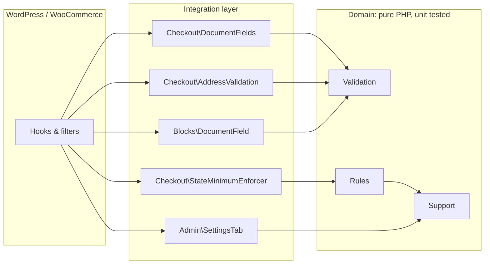

# Brazil Checkout Essentials for WooCommerce

[](https://github.com/lucascampos-dev/wc-brazil-checkout-essentials/actions/workflows/ci.yml)
[](composer.json)
[](wc-brazil-checkout-essentials.php)
[](LICENSE)

Selling in Brazil means asking for a **CPF or CNPJ**, dealing with **CEP** and **phone** formats, and often refusing orders that are too small to ship to faraway states. This plugin covers those checkout basics in a small, tested and well-documented codebase. It makes **no external API calls**, and customer data never leaves the store.

> **Highlights:** CPF/CNPJ check-digit validation, including the new **alphanumeric CNPJ** (2026), · CEP ↔ state (UF) consistency check · minimum order amount per state · HPOS compatible · Cart/Checkout Blocks aware · zero-jQuery front end · 119 WordPress-free unit tests.

---

## Table of contents

- [Features](#features)
- [Screenshots](#screenshots)
- [Requirements](#requirements)
- [Installation](#installation)
- [Configuration](#configuration)
- [Cart & Checkout Blocks](#cart--checkout-blocks)
- [Hooks for developers](#hooks-for-developers)
- [Architecture](#architecture)
- [Testing & quality](#testing--quality)
- [Security & privacy](#security--privacy)
- [Roadmap](#roadmap)
- [License](#license)
- [Author](#author)

---

## Features

### 1. CPF / CNPJ with person type
- **Person type** selector: *Individual (Pessoa Física)* or *Company (Pessoa Jurídica)*. Only the matching document field is shown.
- **Server-side check-digit validation** (modulo 11) in pure PHP classes with no WordPress dependency.
- **Alphanumeric CNPJ** support (e.g. `12.ABC.345/01DE-35`), following the format the Brazilian federal revenue service introduced in July 2026. Numeric CNPJs still validate as before.
- Rejects well-formed but never-issued sequences such as `111.111.111-11`.
- Company name becomes required for CNPJ orders. You can turn this off with a filter.
- **Input masks** in a small vanilla-JS file (no jQuery required).
- Values are stored on the order under `_billing_persontype`, `_billing_cpf` and `_billing_cnpj`. Many Brazilian invoicing and payment integrations already read these keys.
- Shown and **editable in the admin order screen**, and included in **order emails**.

### 2. CEP and phone
- CEP is normalized to `00000-000`, and unallocated ranges such as `00000-000` are rejected.
- **CEP ↔ state check.** The plugin rejects a CEP that doesn't belong to the selected UF (for example a São Paulo CEP with "Rio de Janeiro" selected), based on the national CEP ranges. It can be toggled off.
- Phone numbers are validated against the **allocated area codes (DDD)**. The plugin accepts landlines `(11) 2345-6789` and mobiles `(11) 91234-5678`, strips `+55` and trunk `0` prefixes, and saves the number in a single canonical format.

### 3. Minimum order amount per state (UF)
- Set a minimum for each of the 27 UFs on a dedicated **WooCommerce → Settings → Brazil Checkout** tab, built with the WC Settings API.
- Amounts can be typed the Brazilian way (`1.234,56`) or the international way (`1,234.56`).
- The state can come from the shipping or the billing address.
- Customers see a notice on the cart page and a **live notice above "Place order"** that updates when the address changes. The order is blocked on submit.
- Money comparisons are done in **integer cents**, which avoids floating-point surprises.

### 4. Modern WooCommerce
- Declares **HPOS (Custom Order Tables)** compatibility. All order access goes through `WC_Order` CRUD methods.
- **Cart/Checkout Blocks aware.** The minimum is enforced through the Store API, and a CPF/CNPJ field is registered with the Additional Checkout Fields API (see [limitations](#cart--checkout-blocks)).

---

## Screenshots

> Screenshots will be added soon. Planned captures:

| File | What it shows |
| --- | --- |
| `docs/screenshots/checkout-person-type.png` | Classic checkout with the person type selector and the masked CPF field |
| `docs/screenshots/checkout-cnpj-alphanumeric.png` | *Company* selected, with an alphanumeric CNPJ being typed |
| `docs/screenshots/checkout-validation-errors.png` | Inline errors: invalid CPF, CEP/state mismatch, invalid DDD |
| `docs/screenshots/checkout-minimum-notice.png` | "Minimum order amount for delivery to …" notice above *Place order* |
| `docs/screenshots/settings-tab.png` | WooCommerce → Settings → Brazil Checkout with per-state minimums |
| `docs/screenshots/admin-order.png` | Admin order screen (HPOS) showing CPF/CNPJ under the billing address |
| `docs/screenshots/blocks-checkout.png` | Checkout block with the "CPF or CNPJ" additional field |

---

## Requirements

| | Minimum |
| --- | --- |
| PHP | 7.4 (tested on 7.4, 8.1, 8.3) |
| WordPress | 6.5 |
| WooCommerce | 8.9 (for the Blocks field; the classic checkout features work on earlier 8.x versions) |

---

## Installation

**From a release ZIP**
1. Download the latest release from the [Releases](https://github.com/lucascampos-dev/wc-brazil-checkout-essentials/releases) page.
2. In WordPress, go to **Plugins → Add New → Upload Plugin**, upload the ZIP and activate it.

**From source**
```bash
cd wp-content/plugins
git clone https://github.com/lucascampos-dev/wc-brazil-checkout-essentials.git
```
Then activate the plugin. You don't need `composer install` to run it: the plugin falls back to its own PSR-4 autoloader when `vendor/` is absent. Composer is only needed for development tools.

**Building a clean ZIP**
```bash
git archive --format=zip --prefix=wc-brazil-checkout-essentials/ -o wc-brazil-checkout-essentials.zip HEAD
```
`.gitattributes` leaves tests, CI and tooling files out of the archive.

---

## Configuration

Go to **WooCommerce → Settings → Brazil Checkout**:

| Setting | Default | Description |
| --- | --- | --- |
| CPF / CNPJ | On | Person type selector and document fields |
| CEP and phone | On | Brazilian CEP/phone validation and formatting |
| CEP matches state | On | Reject a CEP that doesn't belong to the selected UF |
| Minimum per state → Enable | Off | Block orders below the state minimum |
| State taken from | Shipping | Use the shipping address (falls back to billing) or always billing |
| One field per UF | *empty* | Minimum amount; leave empty or `0` for no minimum |

The minimum is compared with the **items subtotal minus discounts**, not counting shipping or fees. Taxes are included when your store displays prices with tax. You can change this with the `wcbce_minimum_order_subtotal` filter.

---

## Cart & Checkout Blocks

The classic (shortcode) checkout gets the full feature set. The block-based checkout is supported, with these documented limitations:

| Feature | Classic checkout | Checkout block |
| --- | --- | --- |
| Minimum order per state | ✅ | ✅ via `woocommerce_store_api_cart_errors` |
| CPF / CNPJ validation | ✅ separate fields + person type | ⚠️ a single **"CPF or CNPJ"** field; the type is detected from the number |
| Person type selector | ✅ | ❌ not available |
| Input masks | ✅ | ❌ the value is formatted server-side on save |
| Order meta key | `_billing_cpf` / `_billing_cnpj` | Stored by WooCommerce as an additional field (`_wc_other/wcbce/document`) |
| Admin / email display | ✅ | ✅ handled by WooCommerce core |
| Field required only for Brazil | ✅ | ⚠️ required for everyone by default. Stores that also sell abroad should use `wcbce_blocks_document_required` |
| CEP ↔ state and DDD validation | ✅ | ❌ planned (see [Roadmap](#roadmap)) |

Blocks support is declared compatible because nothing breaks and the core rules (document validity, minimum amount) are enforced. The table above lists what is still classic-only.

---

## Hooks for developers

All hooks are prefixed with `wcbce_`.

### Filters

| Hook | Arguments | Purpose |
| --- | --- | --- |
| `wcbce_state_minimum_amount` | `float $minimum, string $state, WC_Cart $cart` | Change or disable (`0`) the minimum for a request |
| `wcbce_minimum_order_subtotal` | `float $subtotal, WC_Cart $cart` | Change the amount compared with the minimum |
| `wcbce_document_is_valid` | `bool $is_valid, string $value, string $type` | Override the CPF/CNPJ result (`$type` is `cpf` or `cnpj`) |
| `wcbce_checkout_document_fields` | `array $fields` | Change the person type / CPF / CNPJ field definitions |
| `wcbce_require_company_for_legal_entity` | `bool $required, array $data` | Make the company name optional for CNPJ orders |
| `wcbce_blocks_document_required` | `bool $required` | Make the Blocks "CPF or CNPJ" field optional |
| `wcbce_settings_fields` | `array $fields` | Add or change fields on the settings tab |

### Actions

| Hook | Arguments | Purpose |
| --- | --- | --- |
| `wcbce_minimum_order_not_met` | `MinimumCheckResult $result` | Fires when a checkout is blocked by the state minimum (for logging or analytics) |

### Examples

```php
// Wholesale customers have no minimum order amount.
add_filter( 'wcbce_state_minimum_amount', function ( $minimum, $state, $cart ) {
	return wc_current_user_has_role( 'wholesale_customer' ) ? 0.0 : $minimum;
}, 10, 3 );

// Compare the minimum against the cart total including shipping.
add_filter( 'wcbce_minimum_order_subtotal', function ( $subtotal, $cart ) {
	return (float) $cart->get_total( 'edit' );
}, 10, 2 );

// Accept a fixed sandbox CPF in a staging environment.
add_filter( 'wcbce_document_is_valid', function ( $is_valid, $value, $type ) {
	return $is_valid || ( 'staging' === wp_get_environment_type() && '000.000.001-91' === $value );
}, 10, 3 );

// Log blocked checkouts.
add_action( 'wcbce_minimum_order_not_met', function ( $result ) {
	wc_get_logger()->info(
		sprintf( 'Minimum not met for %s: %.2f of %.2f', $result->state(), $result->subtotal(), $result->minimum() ),
		[ 'source' => 'wcbce' ]
	);
} );
```

The validators are plain PHP classes, so you can reuse them anywhere:

```php
use BrazilCheckoutEssentials\Validation\CnpjValidator;

$cnpj = new CnpjValidator();
$cnpj->is_valid( '12.ABC.345/01DE-35' ); // true
$cnpj->format( '11222333000181' );        // "11.222.333/0001-81"
```

---

## Architecture

```
wc-brazil-checkout-essentials/
├── wc-brazil-checkout-essentials.php   # Header, autoloader, bootstrap hooks
├── uninstall.php                       # Removes options (keeps order data)
├── src/
│   ├── Plugin.php                      # Composition root: builds and wires objects
│   ├── Settings.php                    # Option names, defaults, typed getters
│   ├── Compatibility.php               # HPOS + Blocks declarations
│   ├── Validation/                     # ── pure PHP, no WordPress ──
│   │   ├── Validator.php               #   interface: normalize / is_valid / format
│   │   ├── CpfValidator.php
│   │   ├── CnpjValidator.php           #   numeric + alphanumeric (2026)
│   │   ├── DocumentValidator.php       #   "CPF or CNPJ" auto-detection
│   │   ├── CepValidator.php            #   CEP + UF ranges
│   │   └── PhoneValidator.php          #   DDD-aware landline/mobile
│   ├── Rules/                          # ── pure PHP, no WordPress ──
│   │   ├── StateMinimumRule.php
│   │   └── MinimumCheckResult.php      #   immutable value object (cents math)
│   ├── Support/                        # ── pure PHP, no WordPress ──
│   │   ├── BrazilianStates.php
│   │   └── AmountParser.php            #   "1.234,56" / "1,234.56" → float
│   ├── Admin/SettingsTab.php           # WC Settings API tab
│   ├── Checkout/                       # Classic checkout integration
│   │   ├── DocumentFields.php
│   │   ├── AddressValidation.php
│   │   ├── StateMinimumEnforcer.php    #   classic + Store API
│   │   └── Assets.php
│   └── Blocks/DocumentField.php        # Additional Checkout Fields API
├── assets/js/checkout.js               # Vanilla JS masks + field toggling
├── assets/css/checkout.css
├── languages/wc-brazil-checkout-essentials.pot
└── tests/Unit/                         # PHPUnit, runs without WordPress
```



**Design decisions**

- **Domain vs. integration.** Business rules (check digits, CEP ranges, minimum amounts) live in framework-free classes. The WooCommerce-facing classes only translate hooks into calls to those rules. This keeps the rules fast to test and easy to reuse.
- **Constructor injection, no global state.** `Plugin` is the only composition root. Each component receives its dependencies and registers its own hooks.
- **Progressive enhancement.** JavaScript only improves the experience. Every rule is enforced again on the server.
- **Interoperability.** Meta keys follow the convention already used by the Brazilian WooCommerce ecosystem.
- **WordPress coding standards.** The code follows WPCS (snake_case methods, tabs, Yoda conditions) with PSR-4 file names, the same approach as WooCommerce's own `src/` directory.

---

## Testing & quality

```bash
composer install     # dev tools: PHPUnit 9.6, WPCS 3, PHPCompatibilityWP
composer test        # 119 unit tests, no WordPress needed
composer lint        # php -l on every file
composer phpcs       # WordPress-Extra + WordPress-Docs + PHP 7.4 compatibility
```

The unit suite covers CPF, CNPJ (numeric and alphanumeric), the combined document validator, CEP (including UF ranges and edge boundaries), phone numbers (DDD, mobile/landline, `+55`/trunk prefixes, E.164), the state-minimum rule (cents rounding, overrides, invalid config) and the amount parser.

GitHub Actions runs **`php -l` and PHPUnit on PHP 7.4, 8.1 and 8.3**, plus a PHPCS job with inline annotations. See [`.github/workflows/ci.yml`](.github/workflows/ci.yml).

> All test fixtures (documents, phone numbers, CEPs) are fictional or textbook examples of the algorithms.

---

## Security & privacy

- **Nonces.** Checkout data is read from WooCommerce's sanitized `$data` array after core has verified `woocommerce-process-checkout-nonce`. Settings are saved through the WC Settings API (nonce `woocommerce-settings`). Admin order edits go through core's order meta box (nonce `woocommerce_meta_nonce`).
- **Capabilities.** `manage_woocommerce` is re-checked before saving settings (defense in depth), and `activate_plugins` is required to see the missing-WooCommerce notice.
- **Sanitization and escaping.** Every value is escaped on output (`esc_html`, `esc_attr`, `esc_url`). Amounts are normalized with a strict parser before they are stored.
- **No external requests.** Validation is fully offline. No CPF/CNPJ is sent to third parties.
- **Uninstall.** `uninstall.php` deletes all plugin options, on every site of a multisite network. Order data (CPF/CNPJ) is **kept on purpose**, because it is part of the store's fiscal records.

---

## Roadmap

- [ ] Person type selector and conditional CPF/CNPJ fields in the checkout block (WooCommerce conditional fields API)
- [ ] CEP ↔ state and DDD validation for the checkout block (Store API)
- [ ] CPF/CNPJ on **My Account → Addresses**, with validation
- [ ] Optional CEP address autofill (opt-in, privacy-friendly provider)
- [ ] `pt_BR` translation shipped in `languages/`
- [ ] JavaScript unit tests for the mask engine, and E2E tests with Playwright + `wp-env`
- [ ] WordPress.org release

Ideas and pull requests are welcome. Please open an issue first for larger changes.

---

## License

[GPL-2.0-or-later](LICENSE), the same license as WordPress and WooCommerce.

---

## Author

Built by **Lucas Campos** — freelance full-stack developer (WordPress, WooCommerce, Power Apps, Power BI).
LinkedIn: https://www.linkedin.com/in/lucas-campos-1146abab
